# Installation & Setup

← [Zurück zur README](README.md) | [Datenschutz & AI-Varianten](DATENSCHUTZ.md)

## Inhaltsverzeichnis

1. [Voraussetzungen](#1-voraussetzungen)
2. [Microsoft Azure — App Registration](#2-microsoft-azure--app-registration)
3. [bexio — API-Schlüssel](#3-bexio--api-schlüssel)
4. [AI-Provider einrichten](#4-ai-provider-einrichten)
   - [Azure OpenAI / Copilot (Standard)](#41-azure-openai--copilot-standard)
   - [Google Gemini (alternativ)](#42-google-gemini-alternativ)
   - [Ollama lokal (alternativ)](#43-ollama-lokal-alternativ)
5. [Konfiguration (.env)](#5-konfiguration-env)
6. [Deployment auf Synology NAS](#6-deployment-auf-synology-nas)
7. [Betrieb & Monitoring](#7-betrieb--monitoring)

---

## 1. Voraussetzungen

| Voraussetzung | Mindestversion |
|---|---|
| Docker & docker-compose | Docker 24.x |
| Synology DSM mit Container Manager | DSM 7.2+ |
| Microsoft 365 / Azure AD Tenant | — |
| bexio Account | — |
| Azure OpenAI Ressource **oder** Google Gemini API-Key | — |

---

## 2. Microsoft Azure — App Registration

MailToBexio verwendet **App-Only Authentication** (Client Credentials Flow). Es ist kein eingeloggter Benutzer nötig.

### 2.1 App Registration erstellen

1. Öffne das [Azure Portal](https://portal.azure.com) → **Microsoft Entra ID** → **App-Registrierungen** → **Neue Registrierung**

<!-- Screenshot: Azure Portal → App-Registrierungen → Neue Registrierung -->
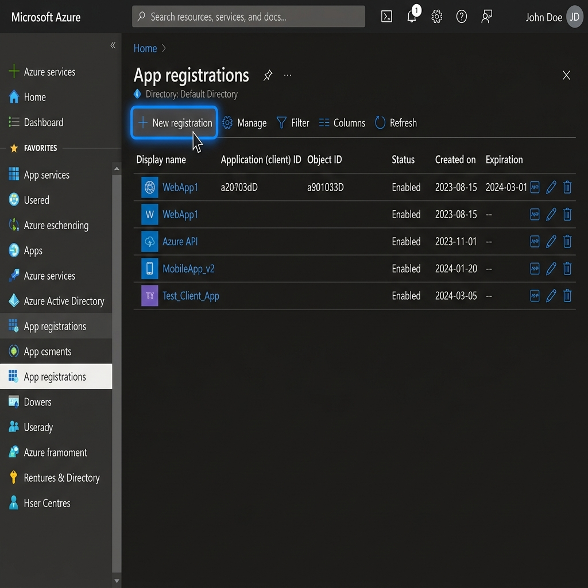

2. Name: `MailToBexio` (oder beliebig), Kontotyp: **Nur diese Organisation**
3. Nach dem Erstellen: **Anwendungs-ID (Client-ID)** und **Verzeichnis-ID (Tenant-ID)** notieren

<!-- Screenshot: App-Übersicht mit Client-ID und Tenant-ID markiert -->
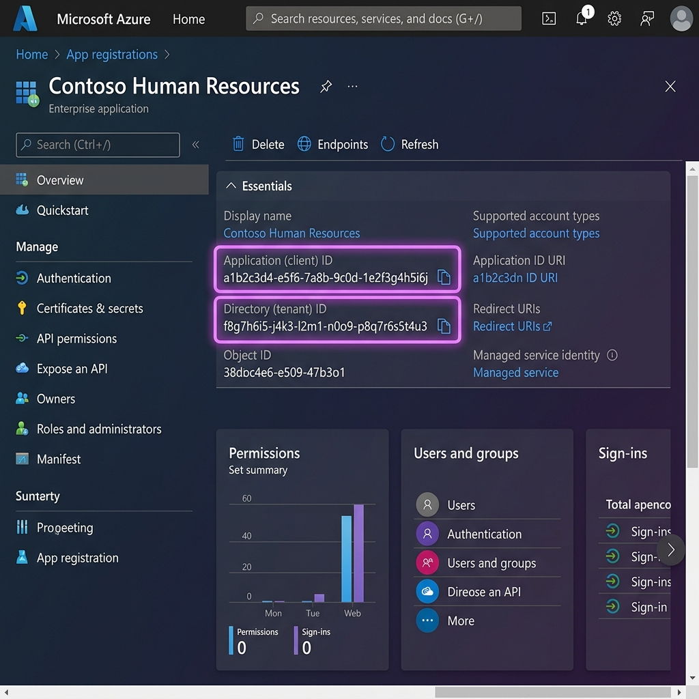

### 2.2 API-Berechtigung hinzufügen

1. **API-Berechtigungen** → **Berechtigung hinzufügen** → **Microsoft Graph** → **Anwendungsberechtigungen**
2. Suche nach `Mail.ReadWrite` → **Anwendungsberechtigung** auswählen (nicht delegiert!)
3. **Administratorzustimmung erteilen** (Button ganz oben)

<!-- Screenshot: API-Berechtigungen mit Mail.ReadWrite (Anwendung) und Admin-Zustimmung erteilt -->
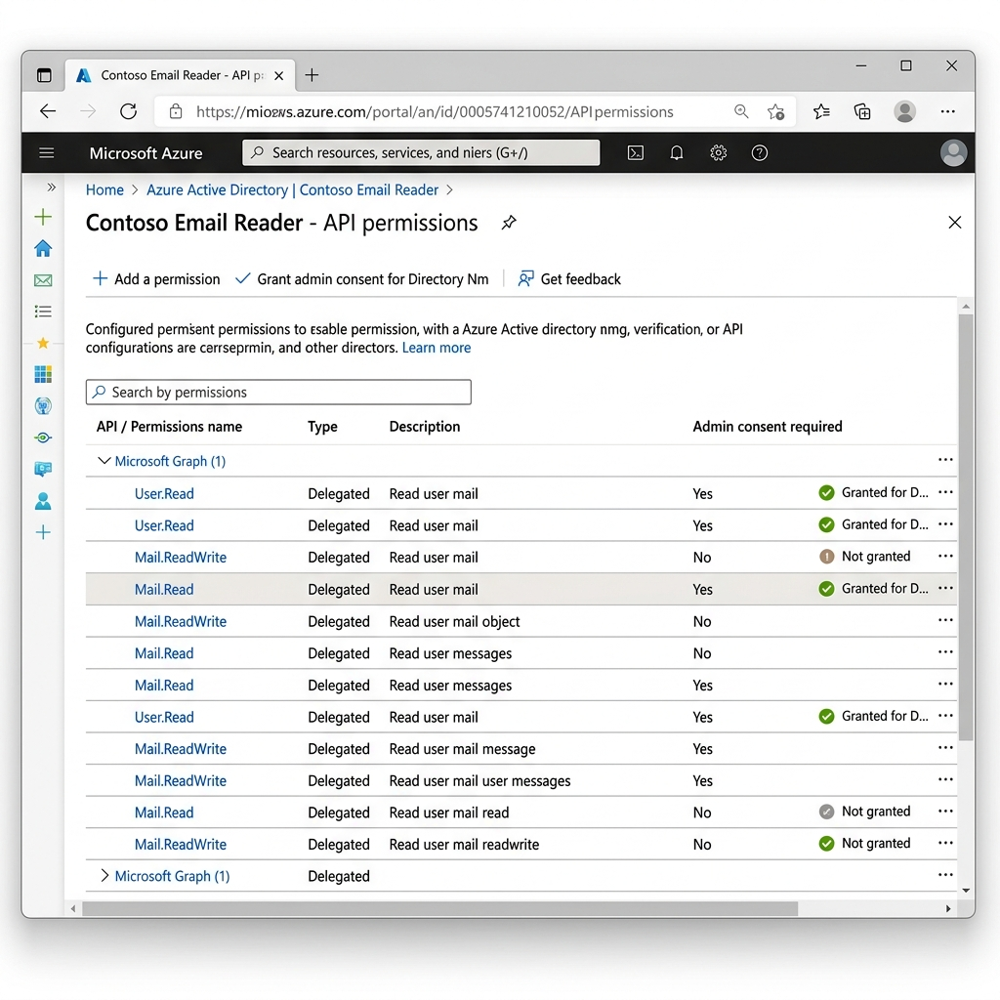

### 2.3 Client Secret erstellen

1. **Zertifikate & Geheimnisse** → **Neuer geheimer Clientschlüssel**
2. Beschreibung: `MailToBexio Prod`, Ablauf: 24 Monate
3. **Wert sofort kopieren** — er wird nur einmal angezeigt!

<!-- Screenshot: Client Secret nach dem Erstellen mit markiertem Wert -->
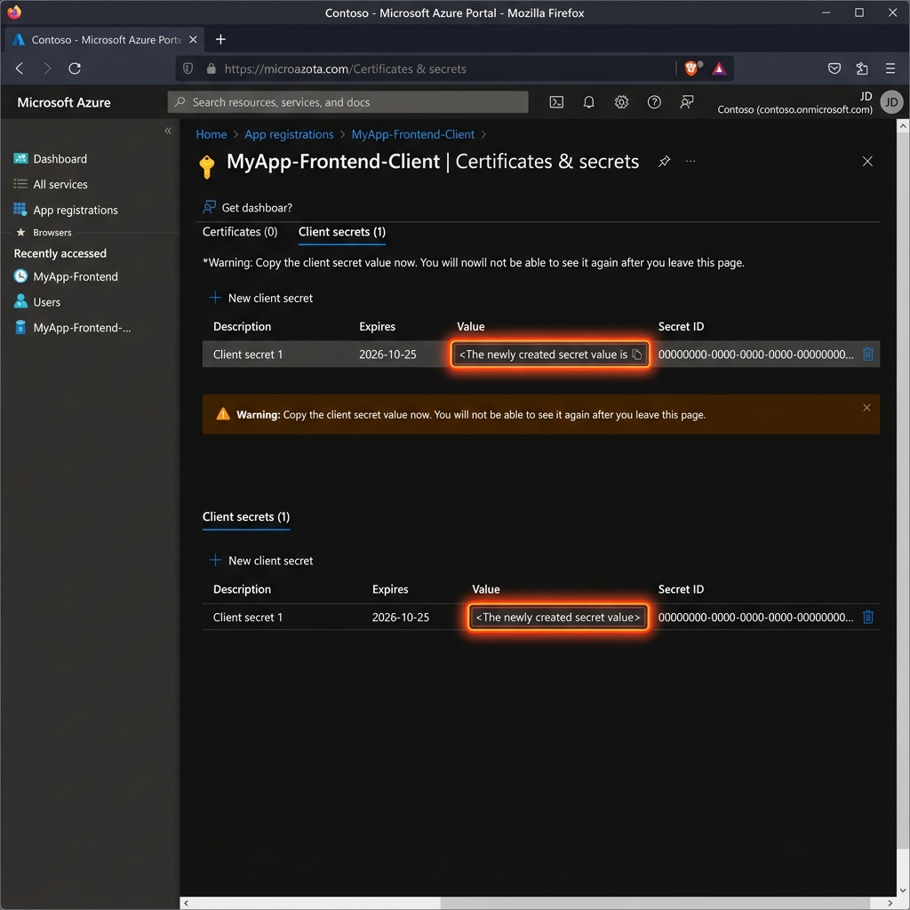

### 2.4 Mailbox-Zugriff auf ein einzelnes Postfach einschränken

> **Wichtig:** Ohne diesen Schritt hat die App Zugriff auf **alle** Postfächer im Tenant!

Führe folgenden PowerShell-Befehl als Exchange-Administrator aus:

```powershell
# Exchange Online PowerShell Modul benötigt
Connect-ExchangeOnline

New-ApplicationAccessPolicy `
  -AppId "<AZURE_CLIENT_ID>" `
  -PolicyScopeGroupId "<TARGET_MAILBOX_UPN>" `
  -AccessRight RestrictAccess `
  -Description "MailToBexio: Zugriff auf Kunden-Erfassung Postfach"
```

Ersetze:
- `<AZURE_CLIENT_ID>` → Client-ID aus Schritt 2.1
- `<TARGET_MAILBOX_UPN>` → E-Mail-Adresse des Zielpostfachs (z.B. `bestellungen@example.com`)

### 2.5 Outlook-Ordner

Im Zielpostfach muss der Eingangsordner existieren:
- `Kunden_Erfassung` — eingehende Kunden-Mails werden hierhin verschoben

Die Unterordner werden bei Bedarf automatisch erstellt:
- `Kunden_Erfassung/Done` — erfolgreich verarbeitete Mails
- `Kunden_Erfassung/Fault` — Mails die nicht geparst werden konnten

<!-- Screenshot: Outlook Ordnerstruktur mit Kunden_Erfassung, Done und Fault -->
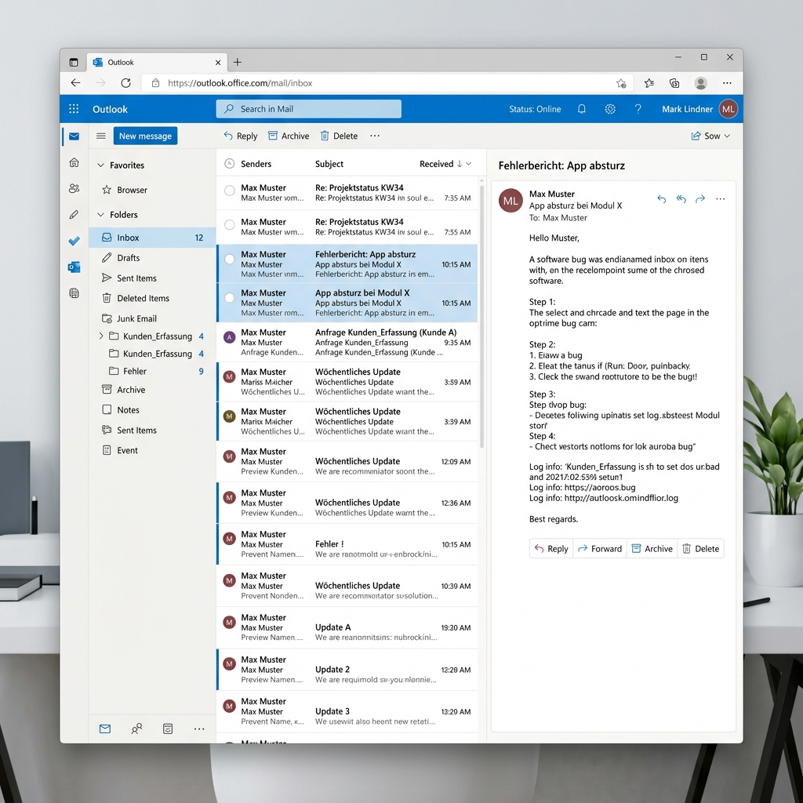

---

## 3. bexio — API-Schlüssel

bexio verwendet einen statischen API-Key (kein OAuth-Flow, kein Token-Refresh nötig).

1. In bexio einloggen → **Einstellungen** (Zahnrad oben rechts) → **API-Schlüssel**

<!-- Screenshot: bexio Einstellungen → API-Schlüssel -->
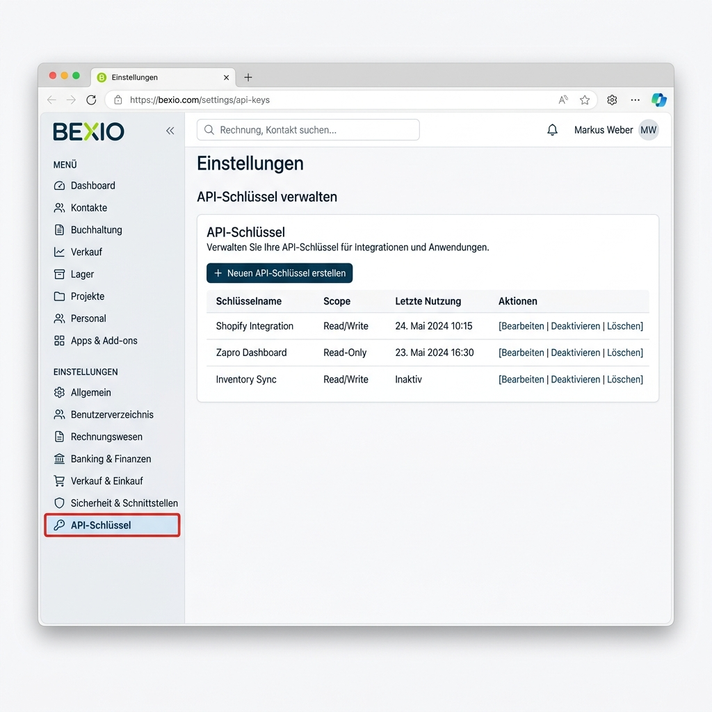

2. **Neuen Schlüssel erstellen** → Name: `MailToBexio`
3. Generierten Schlüssel sofort kopieren und sicher ablegen

<!-- Screenshot: bexio API-Schlüssel nach dem Erstellen -->
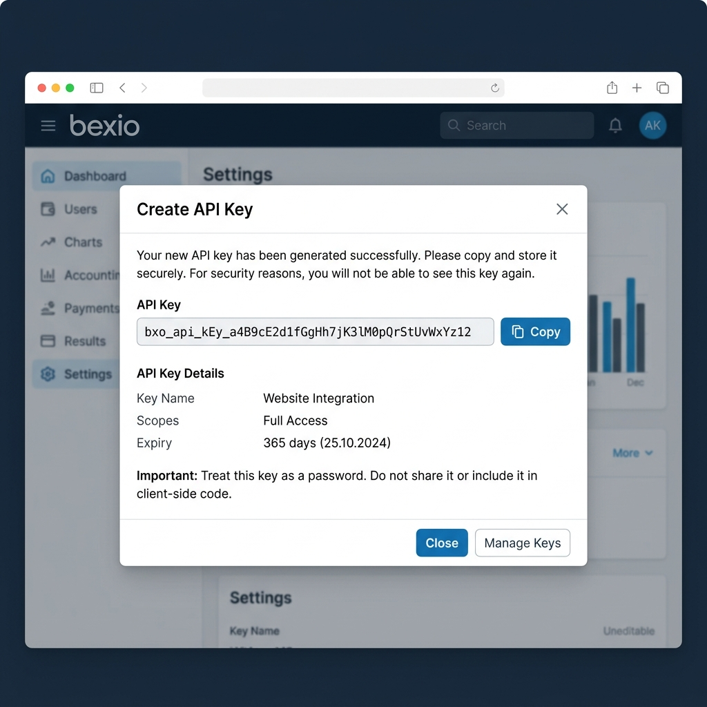

---

## 4. AI-Provider einrichten

### 4.1 Azure OpenAI / Copilot (Standard)

1. Im [Azure Portal](https://portal.azure.com) → **Azure OpenAI** → deine Ressource → **Schlüssel und Endpunkt**
2. **Endpunkt** und **Schlüssel 1** notieren

<!-- Screenshot: Azure OpenAI → Schlüssel und Endpunkt -->
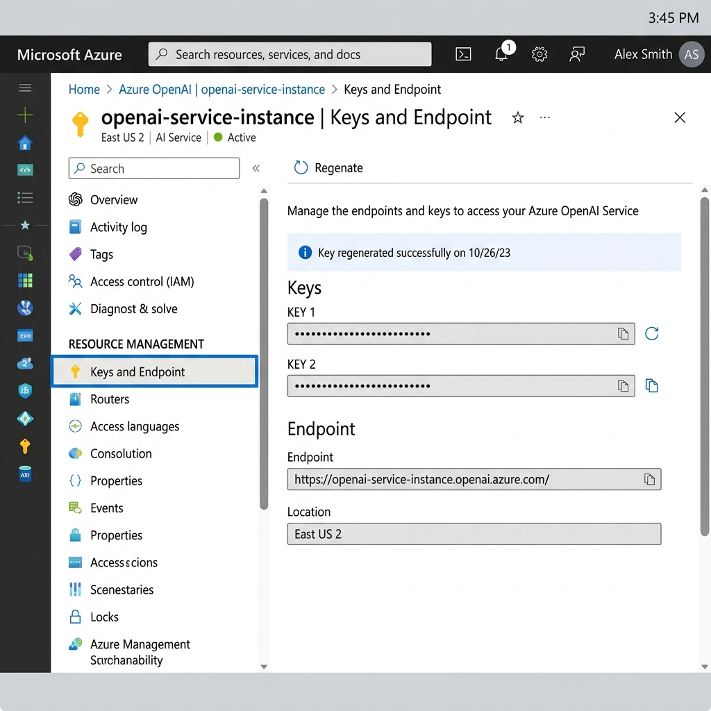

3. In **Azure AI Studio** → **Deployments** → **Modell deployen** → `gpt-4o` wählen
4. **Deployment-Name** notieren (z.B. `gpt-4o`)

<!-- Screenshot: Azure AI Studio → Deployments mit gpt-4o -->
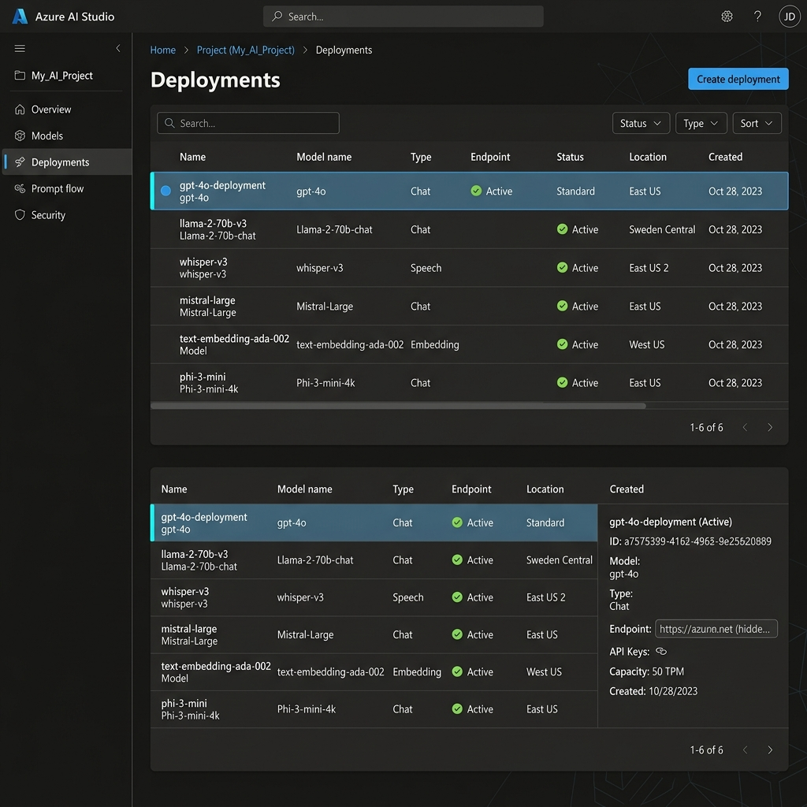

In `.env` setzen:
```dotenv
AI_PROVIDER=Copilot
COPILOT_ENDPOINT=https://your-resource.openai.azure.com/
COPILOT_API_KEY=...
COPILOT_DEPLOYMENT_NAME=gpt-4o
```

### 4.2 Google Gemini (alternativ)

1. [Google AI Studio](https://aistudio.google.com) → **Get API Key** → **Create API key**
2. Projekt auswählen oder neu erstellen

<!-- Screenshot: Google AI Studio → API Key erstellen -->
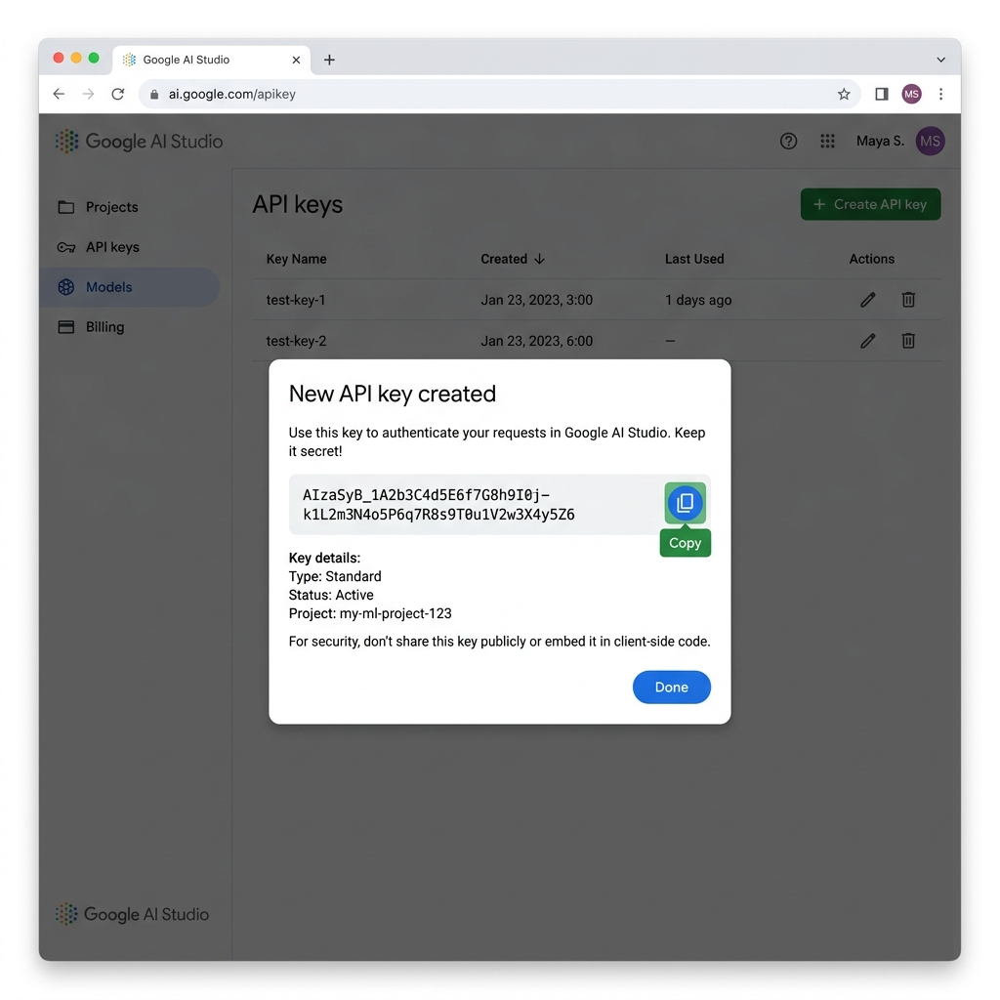

In `.env` setzen:
```dotenv
AI_PROVIDER=Gemini
GEMINI_API_KEY=...
```

### 4.3 Ollama lokal (alternativ)

Geeignet für lokale Tests ohne externe API-Kosten.

```bash
# Ollama installieren (https://ollama.com)
ollama pull qwen2.5:7b
ollama serve  # läuft auf http://localhost:11434
```

In `.env` setzen:
```dotenv
AI_PROVIDER=Ollama
OLLAMA_BASE_URL=http://localhost:11434
OLLAMA_MODEL=qwen2.5:7b
```

Oder Ollama direkt mit Docker Compose starten:
```bash
docker compose -f docker-compose.yml -f docker-compose.ollama.yml up -d --build
```

Dabei wird `OLLAMA_MODEL` automatisch in das Docker-Volume `ollama-data` geladen und die App nutzt intern `http://ollama:11434`.
`http://localhost:11434` funktioniert nur, wenn MailToBexio direkt auf dem Host läuft. Im Docker-Container muss Ollama über den Compose-Service-Namen `ollama` erreichbar sein.

---

## 5. Konfiguration (.env)

Kopiere `.env.example` zu `.env` und fülle alle Werte aus:

```bash
cp .env.example .env
```

| Variable | Beschreibung | Woher |
|---|---|---|
| `AZURE_TENANT_ID` | Azure AD Verzeichnis-ID | Schritt 2.1 |
| `AZURE_CLIENT_ID` | App Registration Client-ID | Schritt 2.1 |
| `AZURE_CLIENT_SECRET` | Client Secret Wert | Schritt 2.3 |
| `TARGET_MAILBOX_UPN` | E-Mail des Zielpostfachs | IT-Admin |
| `TARGET_MAILBOX_FOLDER` | Ordner mit den zu verarbeitenden Mails | Outlook |
| `TARGET_MAILBOX_DONE_FOLDER` | Unterordner fuer erfolgreich verarbeitete Mails | Outlook |
| `TARGET_MAILBOX_FAULT_FOLDER` | Unterordner fuer nicht verarbeitbare Mails | Outlook |
| `BEXIO_API_KEY` | bexio API-Schlüssel | Schritt 3 |
| `AI_PROVIDER` | `Copilot` / `Gemini` / `Ollama` | Schritt 4 |
| `COPILOT_ENDPOINT` | Azure OpenAI Endpunkt-URL | Schritt 4.1 |
| `COPILOT_API_KEY` | Azure OpenAI API-Key | Schritt 4.1 |
| `COPILOT_DEPLOYMENT_NAME` | Deployment-Name (z.B. `gpt-4o`) | Schritt 4.1 |
| `GEMINI_API_KEY` | Google Gemini API-Key | Schritt 4.2 |
| `OLLAMA_BASE_URL` | Ollama Server URL | Schritt 4.3 |
| `OLLAMA_MODEL` | Ollama Modellname (z.B. `qwen2.5:7b`) | Schritt 4.3 |
| `OLLAMA_PORT` | Host-Port fuer den Ollama Container (Standard: `11434`) | Schritt 4.3 |
| `WORKER_INTERVAL_MINUTES` | Abfrageintervall in Minuten (Standard: 5) | — |

> **Sicherheit:** Die `.env`-Datei **niemals** ins Git committen — sie ist in `.gitignore` eingetragen.

---

## 6. Deployment auf Synology NAS

### 6.1 Voraussetzungen auf der Synology

- **Container Manager** installiert (Synology Package Center)
- SSH aktiviert (DSM → Systemsteuerung → Terminal & SNMP)
- Git installiert (via Synology Package Center oder `opkg`)

### 6.2 Erstinstallation

```bash
# 1. Per SSH auf die Synology verbinden
ssh admin@<synology-ip>

# 2. Repo klonen
git clone https://github.com/your-org/MailToBexio.git /volume1/docker/mailtobexio
cd /volume1/docker/mailtobexio

# 3. .env mit echten Werten befüllen
cp .env.example .env
vi .env
```

<!-- Screenshot: Synology SSH Terminal mit ausgefüllter .env -->
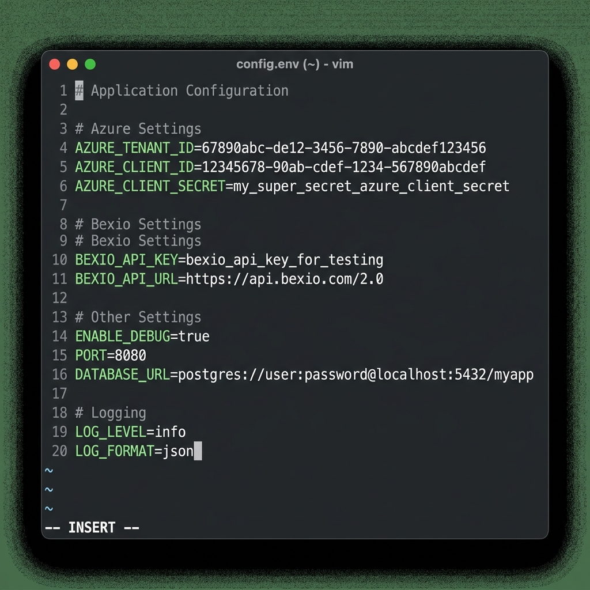

```bash
# 4. Container bauen und starten
docker compose up -d --build

# 5. Logs prüfen (erste Minuten beobachten)
docker compose logs -f
```

### 6.3 Container im Synology Container Manager überwachen

Nach dem Start ist der Container im Container Manager sichtbar:

<!-- Screenshot: Synology Container Manager mit laufendem mailtobexio Container -->
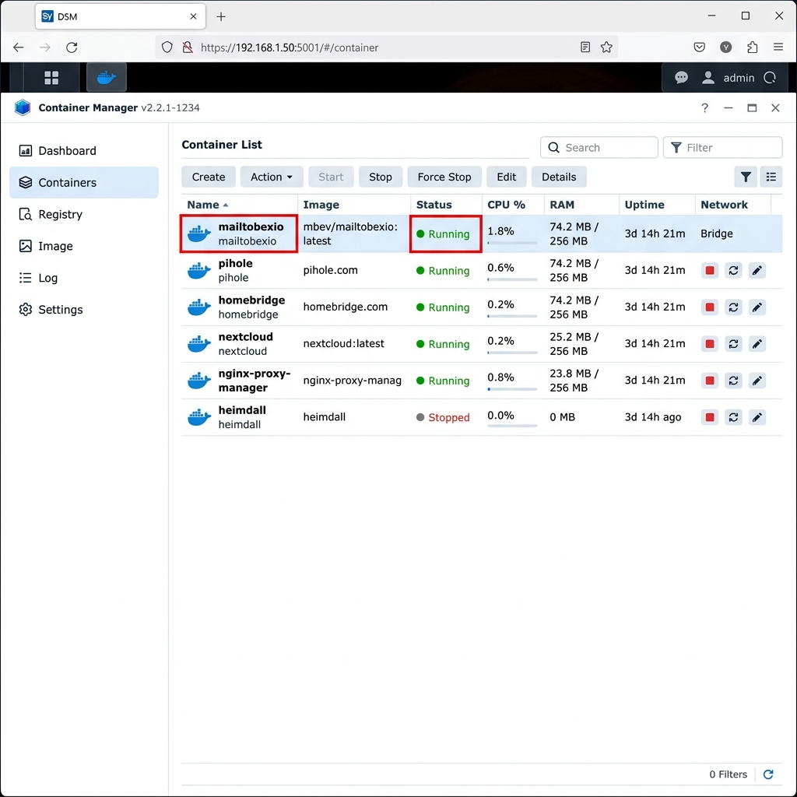

Der Container startet bei jedem NAS-Neustart automatisch (`restart: unless-stopped`).

### 6.4 Updates einspielen

```bash
cd /volume1/docker/mailtobexio
git pull
docker compose up -d --build
```

### 6.5 Logs einsehen

**Via SSH:**
```bash
docker compose logs -f
# oder direkt:
tail -f /volume1/docker/mailtobexio/logs/mailtobexio-*.log
```

**Via Container Manager:**

<!-- Screenshot: Synology Container Manager → Container → Details → Log -->
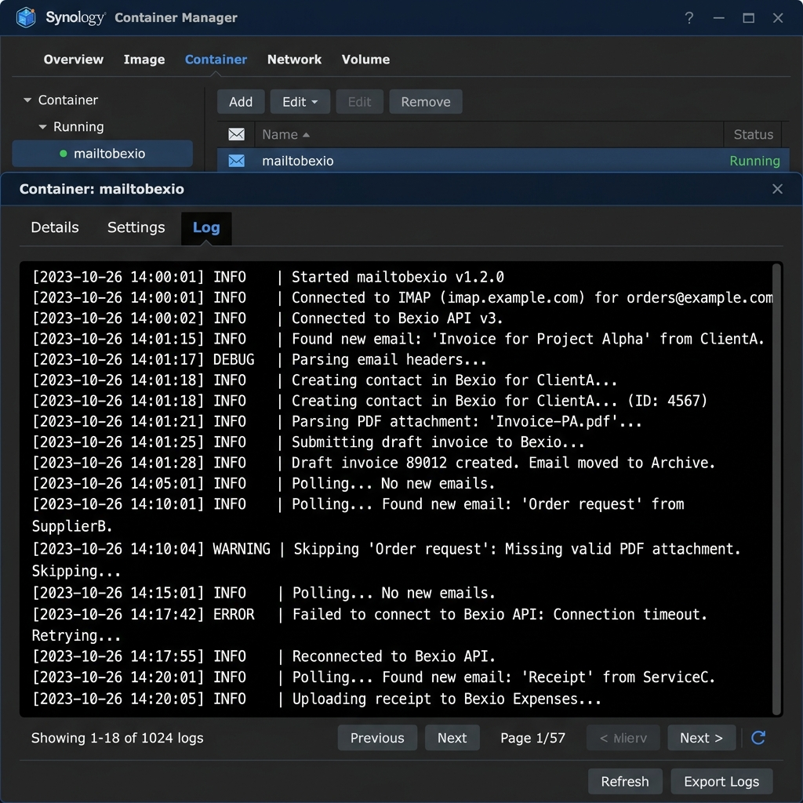

---

## 7. Betrieb & Monitoring

### Verarbeitungsablauf

```
Alle N Minuten (Standard: 5):
  ├── Ungelesene Mails in "Kunden_Erfassung" abrufen
  ├── Pro Mail:
  │   ├── KI extrahiert Kontaktdaten (JSON)
  │   ├── Validierung (E-Mail + Name vorhanden?)
  │   │   └── Ungültig → Mail in "Fault" verschieben
  │   ├── bexio: Suche nach E-Mail → Firma → Person
  │   │   └── Treffer → Mail in "Done" verschieben, kein Kontakt angelegt
  │   └── Kein Treffer → Firma + Kontaktperson anlegen → Mail in "Done" verschieben
  └── Warten bis zum nächsten Zyklus
```

### Log-Einträge verstehen

| Log-Meldung | Bedeutung |
|---|---|
| `Verarbeitungszyklus gestartet` | Normaler Zyklus, alles OK |
| `Keine neuen Nachrichten` | Kein Handlungsbedarf |
| `Kontakt mit E-Mail X existiert bereits` | Duplikat erkannt, korrekt übersprungen |
| `Firma 'X' angelegt` | Neuer bexio-Kontakt erstellt |
| `KI konnte keine validen Daten extrahieren` | Mail landet im Fault-Ordner |
| `Graph API Fehler` | Azure-Verbindungsproblem prüfen |
| `bexio POST /contact Fehler` | bexio API-Key oder Payload prüfen |

### Fault-Ordner überwachen

Mails im Ordner `Fault` sollten regelmässig manuell überprüft werden. Mögliche Ursachen:
- E-Mail enthält keine strukturierten Kontaktdaten
- KI hat halluziniert und kein valides JSON zurückgegeben
- E-Mail-Body ist leer oder verschlüsselt (z.B. S/MIME)

---

← [Zurück zur README](README.md)
